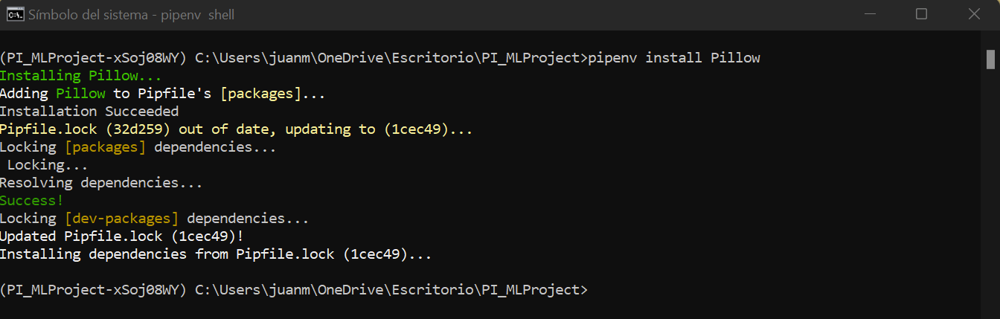
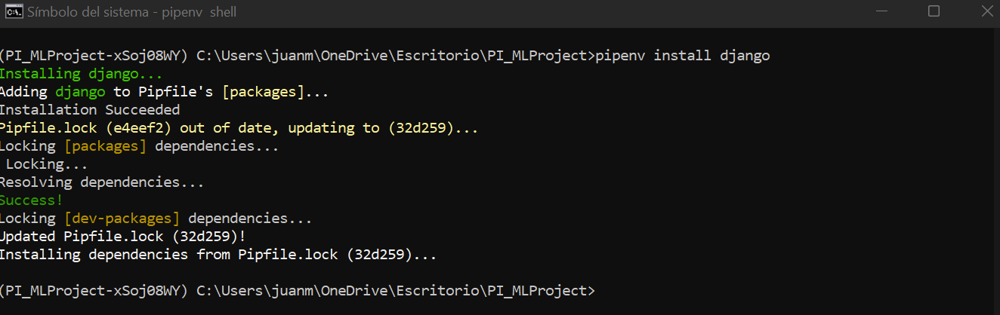
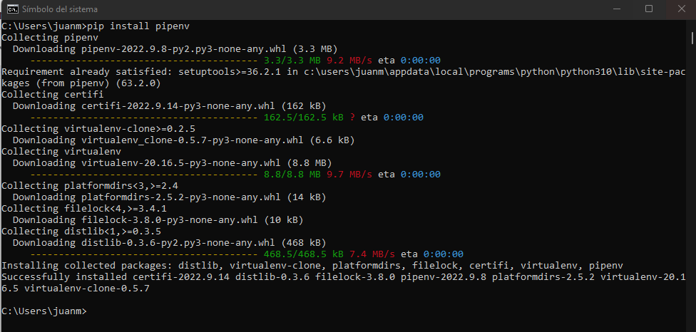
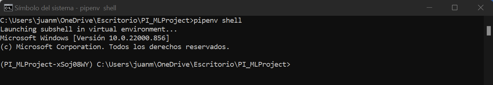
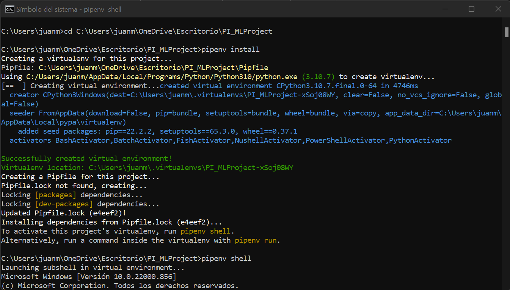
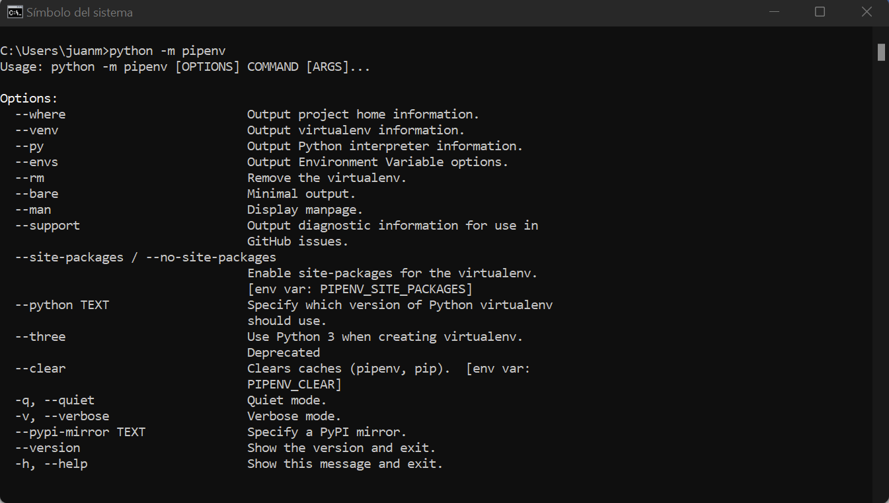
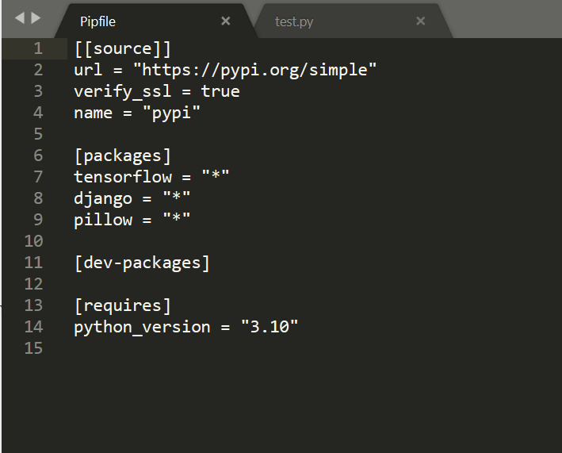
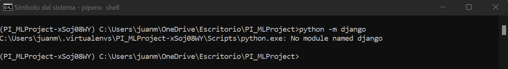
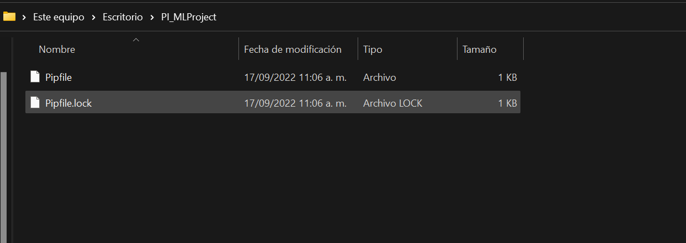

# <h1> Instalación de librerías </h1> 

Este primer paso es opcional. Sin embargo, es recomendable crear un ambiente virtual para cada uno de los proyectos en los que se está trabajando.

1. Instale pipenv (también puede crearse con virtualenv, anaconda)

**pip install pipenv**

2. Verifique que pipenv se instaló correctamente

**python -m pipenv**

3. Cree una carpeta para el proyecto y desde la consola ubíquese en esta carpeta. En este ejemplo se creó la carpeta PI_MLProject en el escritorio

**cd C:\Users\juanm\OneDrive\Escritorio\PI_MLProject**

4. Cree el ambiente virtual (quedará con el nombre del current path)

**pipenv install**

En la carpeta del proyecto deberán verse los siguientes documentos:

5. Active el ambiente virtual

**pipenv shell**

En este punto la consola debe verse de la siguiente forma:

Desde este punto podremos instalar paquetes en el ambiente virtual usando pipenv en vez de pip.

Si no creó el ambiente virtual, puede seguir los pasos desde acá cambiando pipenv por pip.

6. Instale tensorflow 2.8.2 en el ambiente virtual dado que es la versión que se utiliza en Google colab (cualquier versión de tensorflow debería funcionar sin problema)

**pipenv install tensorflow==2.8.2**

7. Compruebe que django esté instalado en el ambiente virtual

**python -m django**

8. En caso de que no esté instalado (como en mi caso), instale django

**pipenv install django**

9. Adicionalmente, debe instalar la librería Pillow para manejo de imágenes

**pipenv install Pillow**

Si abre el archivo Pipfile notará que aparece la lista de los paquetes instalados:

